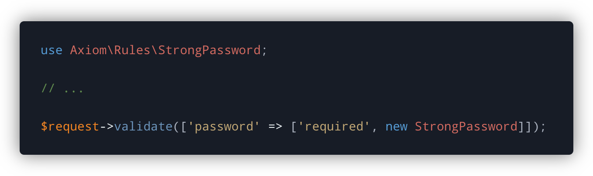
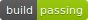
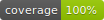
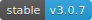
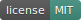

<!-- Screenshot -->
<p align="center">
    
</p>

<!-- Badges -->
<p align="center">
  
  
  
  
</p>

# Axiom

This package provides a library of reusable validation rules for your Laravel projects. Use them to augment the existing set provided by Laravel itself.

Axiom is a re-release of the original `alphametric/laravel-validation-rules` package, which was also created by myself. This new version includes a rewrite to support PHP 7.4+ and also includes type hinting as well as some additional refactoring.

## Installation

Pull in the package using composer

```bash
composer require mattkingshott/axiom
```

## Upgrading

Axiom includes several breaking changes from the original package, so you'll need to follow these steps if you were using the old version:

1. Ensure that you are using PHP 7.4 or later.
2. Remove `alphametric/laravel-validation-rules` from your `composer.json` file.
3. Run `composer update` to remove the package from your `vendor` directory.
4. Install Axiom by running `composer require mattkingshott/axiom`.
5. Replace all instances of `use Alphametric\Validation` with `use Axiom`.
6. The `EndsWith` rule has been removed as Laravel now natively supports this.
7. The `Equals` rule has been removed. Instead, you should use Laravel's native `in` rule with a single option.
8. The `DoesNotExist` rule has been renamed to `Missing`.

## Usage

As per the Laravel [documentation](https://laravel.com/docs/master/validation#using-rule-objects), simply import the relevant validation class wherever you require it, and then include it within the rules for a particular field:

```php
use Axiom\Rules\StrongPassword;

// ...

$request->validate([
    'password' => ['bail', 'required', new StrongPassword],
]);
```

**IMPORTANT**: As with all custom rules, you cannot use a pipe-delimited string. You must instead use an `array` e.g.

```php
'password' => ['bail', 'required', new StrongPassword] // correct
'password' => 'bail|required|new StrongPassword'       // wrong
```

If the validation fails, the package will attempt to respond with a localized error message (see message keys below). If the key does not exist, it will fall back to a hard-coded English language version.

## Available rules

The following validation rules are currently available:

| Rule                  | Message Key                       | Description                                                                                                           |
| --------------------- | --------------------------------- | --------------------------------------------------------------------------------------------------------------------- |
| StrongPassword        | validation.strong_password        | Requires the presence of a "strong" password - see class for details                                                  |
| TelephoneNumber       | validation.telephone_number       | Requires the presence of a valid telephone number - see class for details                                             |
| RecordOwner           | validation.record_owner           | Requires the authenticated user's id to match the user_id column on a given database record e.g. owner:posts,id       |
| MonetaryFigure        | validation.monetary_figure        | Requires the presence of a monetary figure e.g $72.33 - see class for details                                         |
| DisposableEmail       | validation.disposable_email       | Requires the presence of an email address which is not disposable                                                     |
| Missing               | validation.missing                | Requires that the given value is not present in a given database table / column - see class for details               |
| Decimal               | validation.decimal                | Requires that the given value is a decimal with an appropriate format - see class for details                         |
| EncodedImage          | validation.encoded_image          | Requires that the given value is a base64-encoded image of a given mime types - see class for details                  |
| LocationCoordinates   | validation.location_coordinates   | Requires that the given value is a comma-separated set of latitude and longitude coordinates                          |
| FileExists            | validation.file_exists            | Requires that the given value is a path to an existing file - see class for details                                   |
| MacAddress            | validation.mac_address            | Requires that the given value is a valid MAC address                                                                  |
| ISBN                  | validation.isbn                   | Requires that the given value is a valid ISBN-10 or ISBN-13 number                                                    |
| EvenNumber            | validation.even_number            | Requires that the given value is an even number (decimals are first converted using intval)                           |
| OddNumber             | validation.odd_number             | Requires that the given value is an odd number (decimals are first converted using intval)                            |
| Lowercase             | validation.lowercase              | Requires that the given value is a lower case string                                                                  |
| Uppercase             | validation.uppercase              | Requires that the given value is a upper case string                                                                  |
| Titlecase             | validation.titlecase              | Requires that the given value is a title case string                                                                  |
| Domain                | validation.domain                 | Requires that the given value be a domain e.g. google.com, www.google.com                                             |
| CitizenIdentification | validation.citizen_identification | Requires that the given value be a citizen identification number of USA, UK, France or Brazil (see class for details) |
| WithoutWhitespace     | validation.without_whitespace     | Requires that the given value not include any whitespace characters                                                   |
| MaxWords              | validation.max_words              | Requires that the given value cannot contain more words than specified                                                |
| HexColor              | validation.hex_color              | Requires that the given value is a valid hex color eg. #fff, #0f0f0f, #00ff0080                                       |

## Contributing

Thank you for considering a contribution to Axiom. You are welcome to submit a PR containing improvements, however if they are substantial in nature, please also be sure to include a test or tests.

## Support the project

If you'd like to support the development of Axiom, then please consider [sponsoring me](https://www.paypal.com/cgi-bin/webscr?cmd=_s-xclick&hosted_button_id=YBEHLHPF3GUVY&source=url). Thanks so much!

## License

The MIT License (MIT). Please see [License File](LICENSE.md) for more information.
